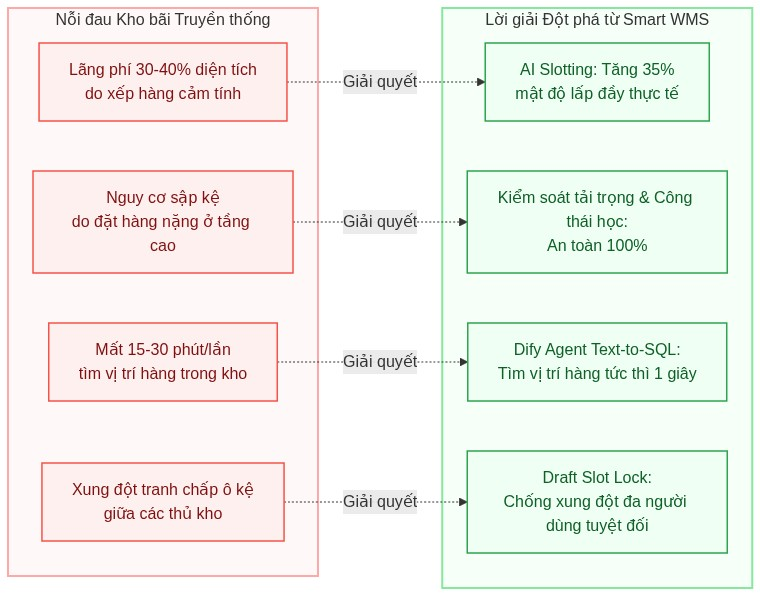
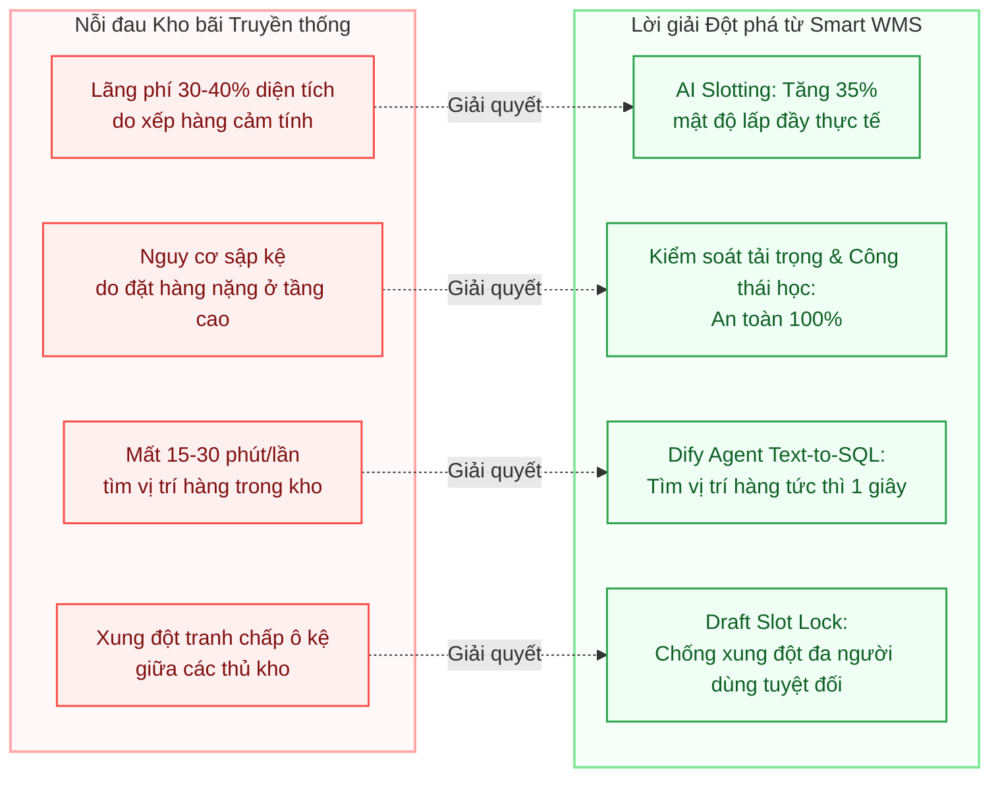
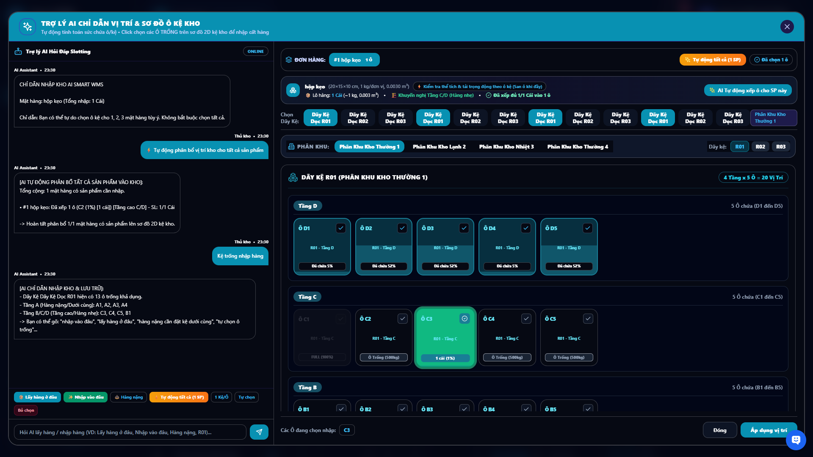
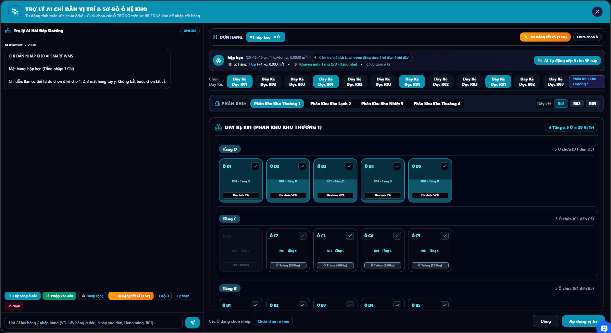
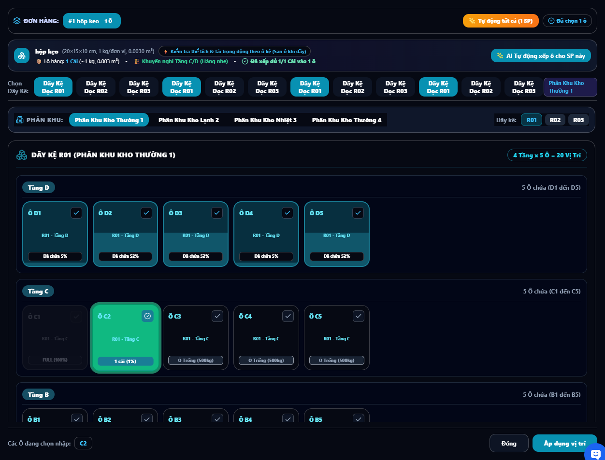
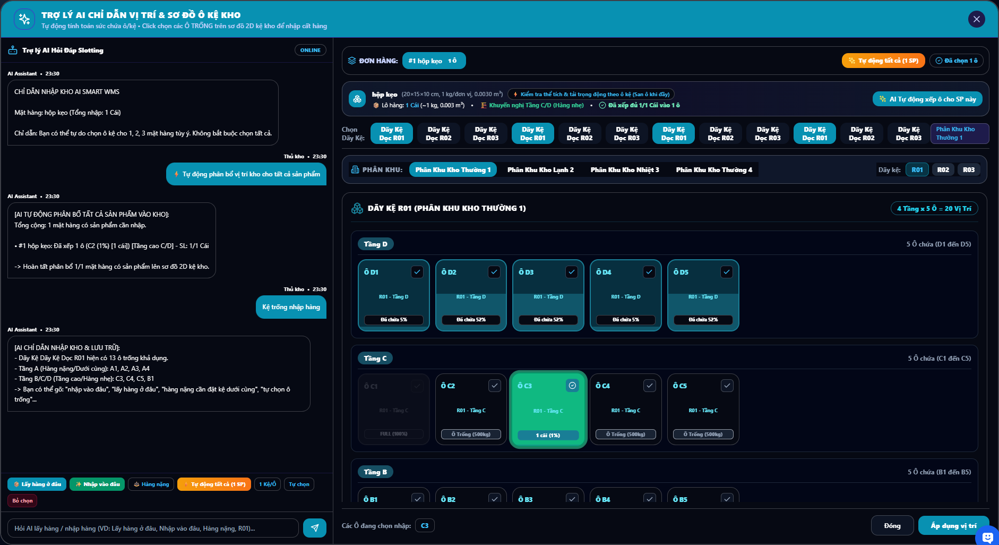
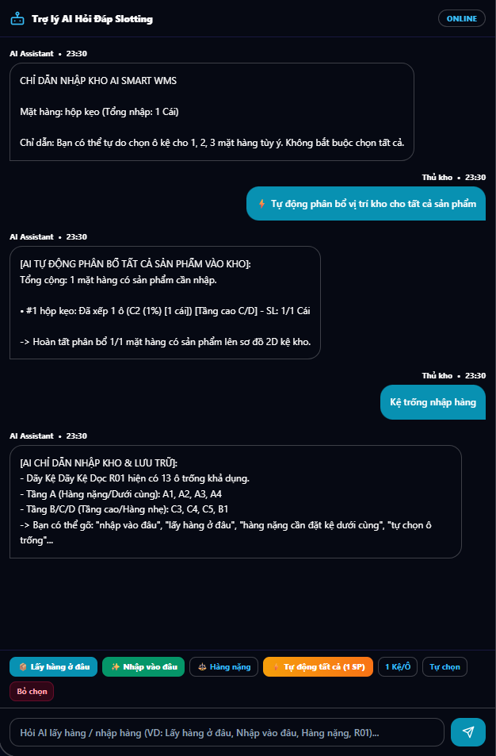
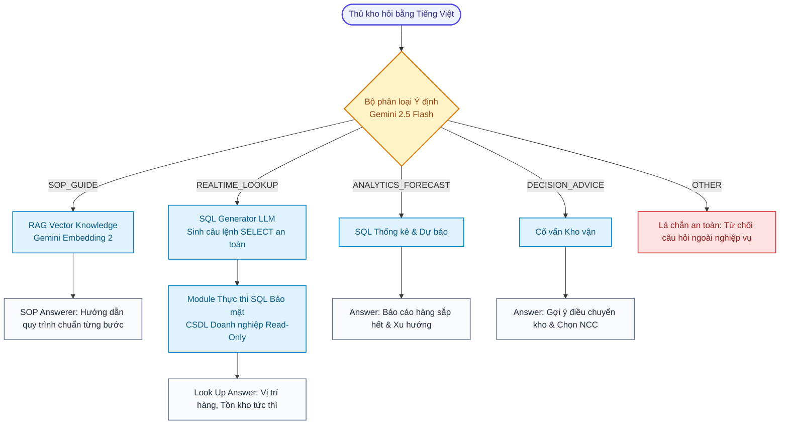
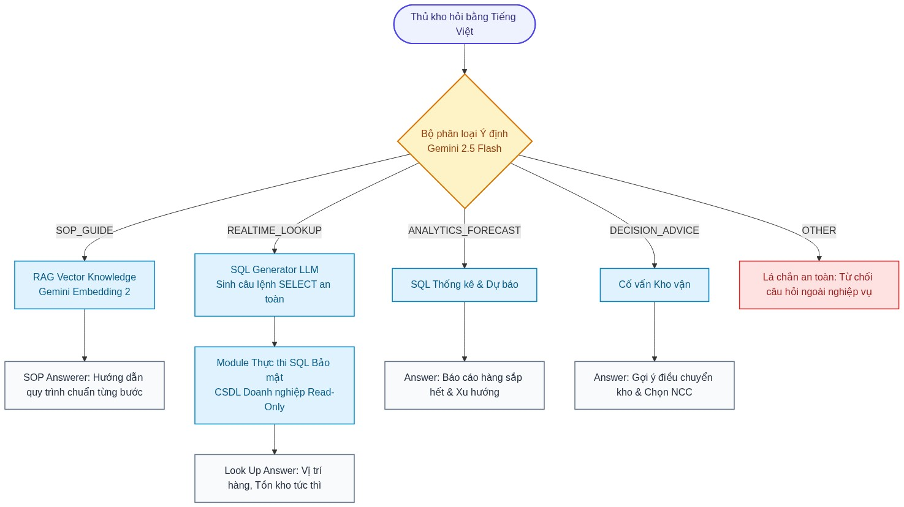
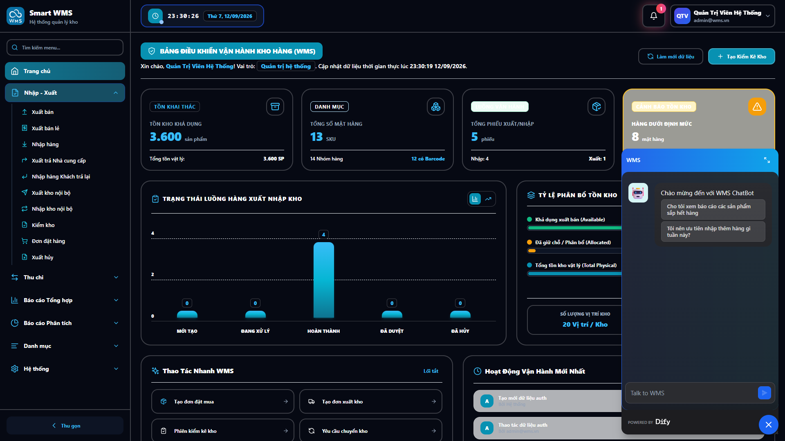

# SMART WMS – HỆ THỐNG QUẢN LÝ KHO THÔNG MINH THẾ HỆ MỚI
## ĐỘT PHÁ VỚI CÔNG NGHỆ AI SLOTTING ĐA TIÊU CHÍ & TRỢ LÝ AGENTIC AI (DIFY)

<p align="center">
  <a href="LICENSE"></a>
  <a href="docs/licenses/LICENSE-APACHE-2.0.md"></a>
  <a href="docs/licenses/LICENSE-AI-SERVICES.md"></a>
  <a href="docs/licenses/STANDARDS-AND-COMPLIANCE.md"></a>
  <a href="#"></a>
  <a href="#"></a>
  <a href="#"></a>
</p>

> **TÀI LIỆU GIỚI THIỆU SẢN PHẨM & ĐẶC TẢ CÔNG NGHỆ**  
> *Sự kết hợp hoàn hảo giữa Thuật toán tối ưu hóa hình học không gian 3D, Bản đồ nhiệt lưới kho tương tác và Trí tuệ nhân tạo đàm thoại Text-to-SQL theo chuẩn `WMS.yml`.*


---

## MỤC LỤC

1. [Lời Giới Thiệu Sản Phẩm & Tầm Nhìn Chiến Lược](#1-lời-giới-thiệu-sản-phẩm--tầm-nhìn-chiến-lược)
2. [Những Thách Thức Lớn Của Kho Hàng Truyền Thống & Lời Giải Từ Smart WMS](#2-những-thách-thức-lớn-của-kho-hàng-truyền-thống--lời-giải-từ-smart-wms)
3. [Công Nghệ Cốt Lõi 1: Phân Hệ AI Slotting Engine – Tối Ưu Không Gian Lưu Trữ Đột Phá](#3-công-nghệ-cốt-lõi-1-phân-hệ-ai-slotting-engine--tối-ưu-không-gian-lưu-trữ-đột-phá)
   - [3.1. Cân bằng Thể tích – Tải trọng & Nhận diện Yếu tố giới hạn (Limiting Factor)](#31-cân-bằng-thể-tích--tải-trọng--nhận-diện-yếu-tố-giới-hạn-limiting-factor)
   - [3.2. Ma trận chấm điểm 6 tiêu chí độc quyền (Multi-Objective Scoring)](#32-ma-trận-chấm-điểm-6-tiêu-chí-độc-quyền-multi-objective-scoring)
   - [3.3. Thuật toán phân rã lô hàng đa ô kệ (Multi-Bin Allocation)](#33-thuật-toán-phân-rã-lô-hàng-đa-ô-kệ-multi-bin-allocation)
   - [3.4. Cơ chế Khóa vị trí nháp chống xung đột đồng thời (Draft Slot Locking)](#34-cơ-chế-khóa-vị-trí-nháp-chống-xung-đột-đồng-thời-draft-slot-locking)
4. [Trải Nghiệm Người Dùng (UX): Bản Đồ Lưới Kệ Trực Quan Tương Tác (Smart Slotting Grid)](#4-trải-nghiệm-người-dùng-ux-bản-đồ-lưới-kệ-trực-quan-tương-tác-smart-slotting-grid)
   - [4.1. Kiến trúc phân cấp kệ trực quan (Rack Topology)](#41-kiến-trúc-phân-cấp-kệ-trực-quan-rack-topology)
   - [4.2. Bản đồ nhiệt trạng thái lấp đầy (Heatmap Occupancy)](#42-bản-đồ-nhiệt-trạng-thái-lấp-đầy-heatmap-occupancy)
   - [4.3. Gợi ý vị trí Top Choice & Thao tác một chạm (One-Click AI Placement)](#43-gợi-ý-vị-trí-top-choice--thao-tác-một-chạm-one-click-ai-placement)
   - [4.4. Trợ lý AI đồng hành trực tiếp trong giao diện Slotting](#44-trợ-lý-ai-đồng-hành-trực-tiếp-trong-giao-diện-slotting)
5. [Công Nghệ Cốt Lõi 2: Trợ Lý Vận Hành Toàn Năng Agentic AI (`WMS.yml`)](#5-công-nghệ-cốt-lõi-2-trợ-lý-vận-hành-toàn-năng-agentic-ai-wmsyml)
   - [5.1. Kiến trúc Workflow đa tác tử (Dify & Google Gemini 2.5 Flash)](#51-kiến-trúc-workflow-đa-tác-tử-dify--google-gemini-25-flash)
   - [5.2. Phân loại ý định thông minh (5 nhóm nghiệp vụ chuyên biệt)](#52-phân-loại-ý-định-thông-minh-5-nhóm-nghiệp-vụ-chuyên-biệt)
   - [5.3. RAG tra cứu quy trình chuẩn SOP siêu tốc](#53-rag-tra-cứu-quy-trình-chuẩn-sop-siêu-tốc)
   - [5.4. Chuyển đổi ngôn ngữ tự nhiên sang SQL thời gian thực (Text-to-SQL)](#54-chuyển-đổi-ngôn-ngữ-tự-nhiên-sang-sql-thời-gian-thực-text-to-sql)
   - [5.5. Cố vấn dự báo & Ra quyết định điều chuyển](#55-cố-vấn-dự-báo--ra-quyết-định-điều-chuyển)
   - [5.6. Lá chắn an toàn dữ liệu & Phòng chống Prompt Injection](#56-lá-chắn-an-toàn-dữ-liệu--phòng-chống-prompt-injection)
6. [Giấy Phép Công Nghệ & Tuân Thủ Tiêu Chuẩn Quốc Tế (Technology Licenses & Compliances)](#6-giấy-phép-công-nghệ--tuân-thủ-tiêu-chuẩn-quốc-tế-technology-licenses--compliances)
   - [6.1. Bản quyền & Giấy phép mã nguồn mở phần mềm (Open Source Licenses)](#61-bản-quyền--giấy-phép-mã-nguồn-mở-phần-mềm-open-source-licenses)
   - [6.2. Điều khoản & Giấy phép Dịch vụ Trí tuệ nhân tạo (AI Platform Licenses)](#62-điều-khoản--giấy-phép-dịch-vụ-trí-tuệ-nhân-tạo-ai-platform-licenses)
   - [6.3. Tuân thủ Tiêu chuẩn Kỹ thuật Kho vận & An toàn Kệ chứa (Logistics Standards)](#63-tuân-thủ-tiêu-chuẩn-kỹ-thuật-kho-vận--an-toàn-kệ-chứa-logistics-standards)
   - [6.4. Tuân thủ An toàn Thông tin & Quản trị Chất lượng (ISO Standards)](#64-tuân-thủ-an-toàn-thông-tin--quản-trị-chất-lượng-iso-standards)

---

## 1. LỜI GIỚI THIỆU SẢN PHẨM & TẦM NHÌN CHIẾN LƯỢC

Trong kỷ nguyên thương mại điện tử bùng nổ và chuỗi cung ứng toàn cầu đòi hỏi tốc độ xử lý tính bằng phút, kho hàng không còn là nơi lưu trữ thụ động, mà đã trở thành **trái tim vận hành** quyết định lợi thế cạnh tranh của doanh nghiệp.

**Smart WMS** tự hào là giải pháp quản lý kho thông minh đột phá, được nghiên cứu và phát triển nhằm giải quyết triệt để bài toán tối ưu hóa mặt bằng và nâng cấp trải nghiệm người vận hành. Với sự hội tụ của:
1. **Thuật toán AI Slotting Engine độc quyền**: Tự động tính toán không gian 3D, tải trọng kệ và gợi ý vị trí lưu trữ hoàn hảo cho từng kiện hàng chỉ trong vài mili-giây.
2. **Giao diện Bản đồ Lưới Kệ Trực quan 2D/3D (Smart Slotting Grid)**: Xóa bỏ hoàn toàn các bảng biểu khô khan, thay thế bằng Heatmap trực quan sống động.
3. **Trợ lý AI Agent đàm thoại thông minh (`WMS.yml`)**: Tích hợp mô hình ngôn ngữ lớn Google Gemini 2.5 Flash, cho phép thủ kho tra cứu tồn kho, tìm vị trí sản phẩm và hỏi đáp quy trình kho hoàn toàn bằng tiếng Việt tự nhiên.

**Sứ mệnh của Smart WMS**: Biến mọi kho hàng truyền thống thành **Trung tâm Phân phối Thông minh (Smart Fulfillment Hub)** – Vận hành chính xác, an toàn tối đa và tiết kiệm chi phí vượt bậc.

---

## 2. NHỮNG THÁCH THỨC LỚN CỦA KHO HÀNG TRUYỀN THỐNG & LỜI GIẢI TỪ SMART WMS



<details>
<summary>🔍 Xem mã nguồn Mermaid Diagram</summary>



</details>

---

## 3. CÔNG NGHỆ CỐT LÕI 1: PHÂN HỆ AI SLOTTING ENGINE – TỐI ƯU KHÔNG GIAN LƯU TRỮ ĐỘT PHÁ

AI Slotting Engine là bộ não toán học giải quyết bài toán **Constraint Satisfaction Problem (CSP)** kết hợp **Multi-Objective Optimization (Tối ưu hóa đa mục tiêu)**.

### 3.1. Cân bằng Thể tích – Tải trọng & Nhận diện Yếu tố giới hạn (Limiting Factor)

Một ô kệ an toàn không chỉ phụ thuộc vào việc "có nhét vừa hay không" mà phụ thuộc vào việc **Tải trọng** hay **Thể tích** sẽ chạm ngưỡng trước:

1. **Số lượng giới hạn theo thể tích**: Áp dụng chiết khấu hệ số xếp hàng thực tế $\eta_{\text{packing}} = 70\%$ dựa trên thể tích khả dụng của ô kệ và thể tích kiện hàng:
   $$N_{\text{volume}} = \left\lfloor \frac{V_{\text{available}}}{V_{\text{item}}} \times 0.70 \right\rfloor$$
2. **Số lượng giới hạn theo tải trọng kệ**:
   $$N_{\text{weight}} = \left\lfloor \frac{W_{\text{bin,max}} - W_{\text{current}}}{m_{\text{item}}} \right\rfloor$$
3. **Số lượng xếp tối đa an toàn**:
   $$N_{\text{max}} = \min(N_{\text{volume}}, N_{\text{weight}})$$
4. **Cảnh báo Yếu tố giới hạn (`LimitingFactor`)**: Hệ thống tự động gắn nhãn cảnh báo thủ kho biết ô này đang bị kịch tải do **"Khối lượng (Weight)"** hay do **"Thể tích (Volume)"**, hỗ trợ việc ra quyết định chính xác 100%.

---

### 3.2. Ma trận chấm điểm 6 tiêu chí độc quyền (Multi-Objective Scoring)

Các ô kệ vượt qua pha lọc ràng buộc cứng sẽ được đưa vào thang chấm điểm đa tiêu chí từ **0 đến 100 điểm**:

$$\text{FinalScore} = (S_1 \times 0.20) + (S_2 \times 0.25) + (S_3 \times 0.15) + (S_4 \times 0.15) + (S_5 \times 0.15) + (S_6 \times 0.10) - \text{Penalty}$$

| STT | Trụ cột tiêu chí | Trọng số | Giá trị mang lại cho doanh nghiệp |
|:---:|---|:---:|---|
| **1** | **Điều kiện Môi trường (Zone Temp)** | **20%** | Phân loại chuẩn xác 100% kho lạnh (`COLD`: -18°C ~ 5°C), kho mát (`THERMAL`: 15°C ~ 22°C) và kho thường (`AMBIENT`). Triệt tiêu rủi ro hỏng hóc hàng hóa nhạy cảm nhiệt. |
| **2** | **An toàn Tải trọng & Công thái học (Weight & Ergonomics)** | **25%** | **Hàng nặng ($\ge 30\text{kg}$)**: Bắt buộc tầng đáy 1-2 để hạ thấp trọng tâm, chống cong võng và sập kệ.<br>**Hàng nhẹ ($< 5\text{kg}$)**: Ưu tiên tầng cao 3-4 để giải phóng mặt sàn.<br>**Hàng trung bình**: Tầng giữa vừa tầm với tay của nhân viên. |
| **3** | **Vận tốc Luân chuyển Hàng hóa (ABC Velocity)** | **15%** | **Hàng nhóm A (Bán chạy)**: Đặt tại đầu dãy kệ, gần cửa xuất kho và tầng thấp để rút ngắn 50% quãng đường di chuyển của xe nâng.<br>**Hàng nhóm C (Lưu kho chậm)**: Đặt sâu bên trong và tầng cao. |
| **4** | **Hiệu suất Lấp đầy Thể tích (Volume Fit)** | **15%** | Ưu tiên các ô có tỷ lệ lấp đầy cao ($\ge 70\%$) để tối ưu mật độ mặt bằng, tránh tình trạng "ki kiện nhỏ chiếm ô lớn". |
| **5** | **Khoảng cách & Lối đi Thuận tiện (Proximity)** | **15%** | Đánh giá độ gần của ô kệ đối với cửa chính và lối đi chính của phân khu. |
| **6** | **Gom cụm Sản phẩm Cùng Loại (Product Affinity)** | **10%** | Tự động xếp cùng dãy kệ hoặc phân khu với các lô hàng cùng SKU/nhóm ngành đã lưu trữ trước đó, giúp kiểm kê nhanh gấp 3 lần. |



*Hình 1: Bảng chi tiết thông số kích thước, khối lượng kiện hàng và khuyến nghị phân bổ vị trí ô kệ từ AI Slotting Engine.*

---

### 3.3. Thuật toán phân rã lô hàng đa ô kệ (Multi-Bin Allocation)

Đối với các lô hàng nhập số lượng lớn vượt quá sức chứa một ô đơn lẻ ($Q > N_{\text{max}}$), AI Slotting Engine tự động kích hoạt chế độ **Chia lô tối ưu**:
1. Tính tổng số ô cần thiết: $K = \lceil Q / N_{\text{max}} \rceil$.
2. Xếp hạng danh sách ô tốt nhất toàn kho theo điểm số giảm dần.
3. Tự động lấp đầy lần lượt từng ô cho đến khi phân bổ hết $100\%$ số lượng hàng hóa.
4. Gắn nhãn ô tối ưu nhất làm **Top Choice** đại diện.

---

### 3.4. Cơ chế Khóa vị trí nháp chống xung đột đồng thời (Draft Slot Locking)

Smart WMS giải quyết triệt để bài toán "hai thủ kho cùng chọn một ô kệ rỗng":
- Ngay khi một ô kệ được chọn trên phiếu nhập nháp, cơ chế `saveActiveDraftSlotLocks` sẽ khóa mềm vị trí đó trong phiên làm việc.
- Màn hình của các nhân viên khác lập tức chuyển ô đó sang màu xám tím kèm biểu tượng khóa 🔒.
- Tự động mở khóa (`releaseActiveDraftSlotLocks`) khi phiếu được lưu hoặc hủy bỏ, đảm bảo tính toàn vẹn dữ liệu thời gian thực.

---

## 4. TRẢI NGHIỆM NGƯỜI DÙNG (UX): BẢN ĐỒ LƯỚI KỆ TRỰC QUAN TƯƠNG TÁC (SMART SLOTTING GRID)

### 4.1. Kiến trúc phân cấp kệ trực quan (Rack Topology)

Hệ thống biểu diễn cấu trúc không gian kho theo 4 cấp bậc chuẩn hóa quốc tế:
$$\text{Kho (Warehouse)} \longrightarrow \text{Phân khu (Zone)} \longrightarrow \text{Dãy kệ (Rack)} \longrightarrow \text{Tầng kệ (Shelf)} \longrightarrow \text{Ô chứa (Bin Cell)}$$

Mã định vị ô kệ được sinh tự động theo chuẩn nhận diện nhanh: `[Khu]-[Dãy]-[Tầng][Ô]` (Ví dụ: `ZA-R01-A1`, `ZB-R02-C3`).



*Hình 2: Toàn cảnh giao diện Modal Smart Slotting Grid hiển thị cấu trúc phân cấp Phân khu -> Dãy kệ -> Tầng kệ -> Ô chứa hàng.*

---

### 4.2. Bản đồ nhiệt trạng thái lấp đầy (Heatmap Occupancy)

Giao diện lưới kệ ứng dụng công nghệ **Bảng nhiệt Heatmap thời gian thực**:

```
+-------------------------------------------------------------------------------+
| [XANH LÁ - EMPTY (0%)]   | Sẵn sàng chứa hàng mới                            |
| [VÀNG - PARTIAL (1-94%)] | Đang chứa hàng - Hiển thị tải trọng còn trống     |
| [ĐỎ - FULL (>=95%)]      | Đã đầy công suất - Chống xếp vượt tải              |
| [TÍM KHÓA - LOCKED 🔒]    | Đang được giữ chỗ bởi đơn hàng nháp khác          |
+-------------------------------------------------------------------------------+
```



*Hình 3: Cận cảnh lưới ô kệ hiển thị bản đồ nhiệt trạng thái lấp đầy (Đã chứa %, FULL 100%, Ô trống tải trọng).*

---

### 4.3. Gợi ý vị trí Top Choice & Thao tác một chạm (One-Click AI Placement)

Chỉ với **1 cú nhấp chuột** vào nút *"AI Gợi ý vị trí"*:
- Màn hình lập tức hiển thị bảng tổng quan phân tích: Thể tích toàn lô ($m^3$), Khối lượng toàn lô ($kg$), Số ô cần sử dụng, Tầng kệ khuyến nghị.
- Tự động highlight vị trí đạt điểm cao nhất (**Top Choice**) và cho phép nhấn **"Áp dụng ngay"** để điền toàn bộ vị trí vào phiếu nhập mà không cần thủ kho phải ghi nhớ bất kỳ tọa độ nào.



*Hình 4: Thuật toán AI tự động tính toán vị trí Top Choice tối ưu nhất và gắn nhãn hoàn tất chỉ với thao tác một chạm.*

---

### 4.4. Trợ lý AI đồng hành trực tiếp trong giao diện Slotting

Tích hợp trực tiếp hộp thoại AI Chatbot ngay tại màn hình lưới kệ, giải thích tường minh mọi quyết định vị trí:
- Nhân viên hỏi: *"Tại sao không xếp pallet này lên tầng D?"*
- AI giải thích: *"Pallet nặng 420kg, nếu xếp tầng D (tầng 4) sẽ gây mất cân bằng động lực học của khung kệ. Khuyến nghị xếp tầng A1 để đảm bảo tiêu chuẩn an toàn EN 15635."*



*Hình 5: Hộp thoại Trợ lý AI đồng hành trực tiếp trong modal, giải đáp nghiệp vụ kho và đề xuất vị trí ô kệ thông minh.*

---

## 5. CÔNG NGHỆ CỐT LÕI 2: TRỢ LÝ VẬN HÀNH TOÀN NĂNG AGENTIC AI (`WMS.yml`)

Phân hệ Trợ lý AI được xây dựng theo kiến trúc **Agentic Advanced Chat Workflow** dựa trên mô hình tiên tiến **Google Gemini 2.5 Flash**, kết nối an toàn với cơ sở dữ liệu kho và cơ sở tri thức SOP nội bộ.

### 5.1. Kiến trúc Workflow đa tác tử


<details>
<summary>🔍 Xem mã nguồn Mermaid Diagram</summary>



</details>

---

### 5.2. Phân loại ý định thông minh (5 nhóm nghiệp vụ chuyên biệt)

Phân hệ Phân loại Ý định (Question Classifier Node) tự động định tuyến chính xác câu hỏi vào 5 kênh tác nghiệp:
1. `SOP_GUIDE`: Hỏi quy trình thao tác kho bãi, tiêu chuẩn bảo quản hàng.
2. `REALTIME_LOOKUP`: Tra cứu số lượng tồn, vị trí ô kệ, thông tin phiếu nhập/xuất, nhà cung cấp.
3. `ANALYTICS_FORECAST`: Thống kê hàng bán chạy, danh sách hàng sắp cạn kho, dự báo nhu cầu nhập.
4. `DECISION_ADVICE`: Đề xuất chiến lược tối ưu không gian, tư vấn chọn nhà cung cấp giá tốt, gợi ý điều chuyển kho.
5. `OTHER`: Bộ lọc câu hỏi ngoài nghiệp vụ và chặn các hành vi tấn công prompt.



*Hình 6: Sơ đồ kiến trúc Workflow đa tác tử Agentic AI được cấu hình trực quan theo chuẩn WMS.yml.*

---

### 5.3. RAG tra cứu quy trình chuẩn SOP siêu tốc

- Ứng dụng mô hình nhúng vector ngữ nghĩa thế hệ mới **Google Gemini Embedding 2 Preview**.
- Tự động tra cứu tài liệu quy trình vận hành kho, trả về hướng dẫn chi tiết theo định dạng hành động rõ ràng: `Bước 1`, `Bước 2`, `Bước 3`..., giúp đào tạo nhân viên mới làm quen kho chỉ trong 1 ngày làm việc.

---

### 5.4. Chuyển đổi ngôn ngữ tự nhiên sang SQL thời gian thực (Text-to-SQL)

- **Công nghệ cốt lõi**: Tự động chuyển đổi câu hỏi tự nhiên tiếng Việt thành truy vấn SQL chuẩn xác.
- **Tính năng Tìm kiếm Gần đúng (Fuzzy Search)**: Kết hợp `LOWER()` và `LIKE '%...%'` trên đa cột, tự hiểu các từ viết tắt, tên sản phẩm không dấu (Ví dụ: gõ *"mác búc"* vẫn tìm chính xác sản phẩm *MacBook Pro 14"*).
- **Kết nối an toàn**: Kết nối cơ sở dữ liệu đám mây thông qua tài khoản dịch vụ chỉ đọc độc lập (Dedicated Read-Only Service Account) tuân thủ nguyên tắc đặc quyền tối thiểu (Principle of Least Privilege), cam kết an toàn tuyệt đối 100% cho dữ liệu gốc.



*Hình 7: Trợ lý WMS Chatbot (Dify Agent) hỗ trợ tra cứu số lượng tồn kho và vị trí sản phẩm tức thì qua Text-to-SQL.*

---

### 5.5. Cố vấn dự báo & Ra quyết định điều chuyển

- Tự động rà soát cơ sở dữ liệu và cảnh báo các sản phẩm có tồn kho khả dụng $\le \text{minimumStock}$.
- Phân tích tỷ lệ chiếm dụng của các phân khu kho để đề xuất lệnh điều chuyển hàng hóa cân bằng tải trọng giữa các kho chi nhánh.

---

### 5.6. Lá chắn an toàn dữ liệu & Phòng chống Prompt Injection

- Cô lập dữ liệu người dùng trong thẻ `<user_input>`.
- Khóa cứng nguyên tắc: Dữ liệu người dùng chỉ là đối tượng phân tích, không có quyền ghi đè System Prompt.
- Chặn đứng 100% các nỗ lực Jailbreak, trích xuất cấu hình hoặc thực thi câu lệnh SQL phá hoại (`DROP`, `DELETE`, `UPDATE`).

---

## 6. GIẤY PHÉP CÔNG NGHỆ & TUÂN THỦ TIÊU CHUẨN QUỐC TẾ (TECHNOLOGY LICENSES & COMPLIANCES)

Hệ thống **Smart WMS** được phát triển và vận hành dựa trên kiến trúc phân tách giấy phép minh bạch (**Multi-license Architecture**), bảo đảm quyền tự do mã nguồn mở cho cộng đồng lập trình viên, đồng thời tuân thủ các cam kết dịch vụ điện toán đám mây và tiêu chuẩn an toàn kho vận công nghiệp quốc tế.

### ⚖️ Bảng Quyền Hạn Mã Nguồn Cốt Lõi ([MIT License](LICENSE))

| Quyền được phép (Permissions) | Điều kiện áp dụng (Conditions) | Giới hạn trách nhiệm (Limitations) |
| :--- | :--- | :--- |
| ✅ **Sử dụng thương mại** (*Commercial use*) | ℹ️ **Bảo lưu thông báo bản quyền** (*License notice*) | ❌ **Miễn trừ trách nhiệm pháp lý** (*No Liability*) |
| ✅ **Chỉnh sửa & tùy biến** (*Modification*) | ℹ️ **Bảo lưu thông báo MIT gốc** (*Copyright notice*) | ❌ **Không bảo hành mặc định** (*No Warranty*) |
| ✅ **Phân phối & phát hành** (*Distribution*) | | |
| ✅ **Sử dụng nội bộ & cá nhân** (*Private use*) | | |
| ✅ **Cấp phép thứ cấp** (*Sublicensing*) | | |

---

### 📑 Danh Mục Phân Tách Giấy Phép & Tài Liệu Kỹ Thuật Đính Kèm

```
┌────────────────────────────────────────────────────────────────────────────────────────┐
│                        SMART WMS DEDICATED LICENSES & COMPLIANCE                       │
├────────────────────────────────────────────────────────────────────────────────────────┤
│  [MÃ NGUỒN ỨNG DỤNG]   ──► docs/licenses/LICENSE-MIT.md (Frontend, Backend & AI Engine)│
│  [AI WORKFLOW ENGINE]  ──► docs/licenses/LICENSE-APACHE-2.0.md (Dify WMS.yml & Plugins)│
│  [ĐIỀU KHOẢN AI CLOUD] ──► docs/licenses/LICENSE-AI-SERVICES.md (Gemini Zero Retention) │
│  [QUY CHUẨN KHO VẬN]   ──► docs/licenses/STANDARDS-AND-COMPLIANCE.md (GS1, EN 15635)  │
│  [TỆP GỐC GITHUB]      ──► LICENSE (Canonical MIT License recognized by GitHub)       │
│  [MỤC LỤC TỔNG HỢP]    ──► LICENSE.md (Thư mục gốc dự án)                              │
└────────────────────────────────────────────────────────────────────────────────────────┘
```

1. 📄 **[Giấy phép MIT License (Application Source Code)](docs/licenses/LICENSE-MIT.md)**:
   - Áp dụng cho toàn bộ mã nguồn giao diện (React 18, Vite, TypeScript), API Backend (NestJS 10, TypeORM) và Thuật toán AI Slotting Engine (`aiSlottingEngine.ts`).
   - Tệp giấy phép chuẩn GitHub: [LICENSE](LICENSE).
2. 📄 **[Giấy phép Apache License 2.0 (AI Agentic Platform)](docs/licenses/LICENSE-APACHE-2.0.md)**:
   - Áp dụng cho cấu hình đồ thị Workflow Dify tại tệp [`WMS.yml`](WMS.yml), plugin thực thi CSDL `rookie_text2data` và các module tích hợp chatbot.
3. 📄 **[Điều khoản Dịch vụ Trí tuệ Nhân tạo & Đám mây (AI & Cloud Terms)](docs/licenses/LICENSE-AI-SERVICES.md)**:
   - Cam kết **Zero Data Retention** của Google Vertex AI & Gemini 2.5 API (dữ liệu kho hàng không bị lưu trữ để huấn luyện mô hình công cộng).
   - Thỏa thuận mức dịch vụ (SLA 99.99%) và an toàn CSDL Đám mây Doanh nghiệp qua tài khoản dịch vụ chỉ đọc an toàn (Read-Only Service Account).
4. 📄 **[Đặc tả Tuân thủ Tiêu chuẩn Kỹ thuật Kho vận & An toàn (Standards Compliance)](docs/licenses/STANDARDS-AND-COMPLIANCE.md)**:
   - **GS1 Global Standards**: Định dạng mã thương phẩm GTIN, mã vạch EAN-13, mã vị trí GLN, mã công nghiệp GS1-128 và SSCC.
   - **An toàn Kệ Kho EN 15635:2008 & ANSI/RMI MH16.1**: Thuật toán phân bổ trọng tâm thấp chống sập kệ và khoảng hở an toàn xe nâng.
   - **Quản lý Chất lượng & An toàn Thông tin**: ISO 9001:2015 (vết kiểm toán kho) và ISO/IEC 27001:2022 (bảo mật RBAC, Bcrypt).
5. 📂 **[Xem tệp điều hướng License tổng hợp tại thư mục gốc: LICENSE.md](LICENSE.md)** hoặc tệp chuẩn [LICENSE](LICENSE).

---

*Tài liệu giới thiệu sản phẩm & đặc tả kỹ thuật Smart WMS. Bản quyền thuộc về đội ngũ phát triển Smart WMS Solution.*
